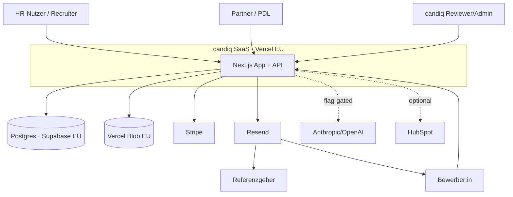
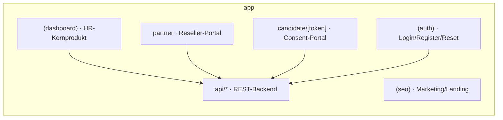
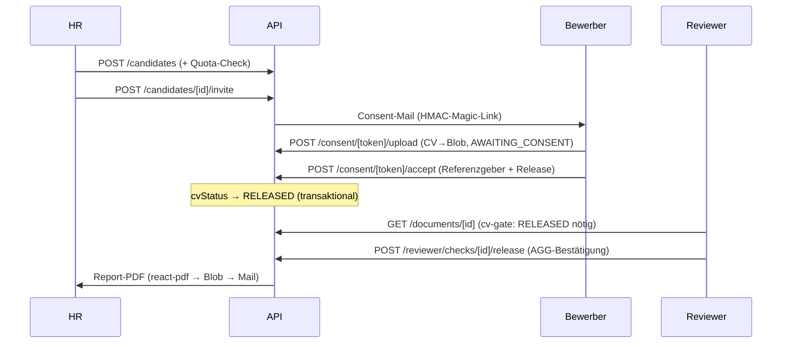

# 01 — Architektur

**Stand:** 2026-07-17 · Basis: `feat/dd-readiness`. Alles unten aus dem Code abgeleitet.

## Stack & Begründung

| Schicht | Technologie | Warum |
|---|---|---|
| Framework | **Next.js 14 (App Router)**, React 18, TypeScript | Ein Deploy-Target für SSR-Pages, API-Routen und Static-Marketing; Server Components halten CV-Daten server-seitig |
| DB / ORM | **Postgres (Supabase, EU-Frankfurt)** via **Prisma** | Managed EU-Hosting (DSGVO), typsicheres Schema, eine Migrations-Quelle |
| Auth | **NextAuth v4** (2 getrennte Instanzen) + HMAC-Magic-Links | Getrennte Vertrauensdomänen HR / Partner / Bewerber (s. `03-SECURITY.md`) |
| Storage | **Vercel Blob** (EU) | Datei-Uploads (CV, Zeugnisse), Report-PDFs |
| Billing | **Stripe** (Subscriptions + One-time-Add-ons) | Standard, Webhook-signaturgeprüft |
| Mail | **Resend** | Transaktionsmails, EU-DNS-verifizierte Domain |
| KI (optional) | **Anthropic / OpenAI** (flag-gated, default off) | CV-Plausibilitäts-Analyse; deterministischer Fallback |
| Voice-Demo | **ElevenLabs** (`@elevenlabs/react`) | Landing-Hero-Sprachagent |
| CRM (optional) | **HubSpot** | Lead-/Pilot-Sync |
| Hosting | **Vercel** (Serverless, EU) + Cron | Zero-Ops-Deploy, Edge-CSP via Middleware |

## C4 — Kontext

## C4 — Container (Route-Gruppen)

## Kernflüsse

### (a) Kandidat → verifizierter Report

### (b) Billing: Trial → planStatus
`register` (trialEndsAt) → `POST /stripe/checkout` → **Webhook** `checkout.session.completed`/`subscription.*`/`invoice.payment_failed` → `user.update{plan,planStatus,currentPeriodEnd}` (Signatur geprüft, idempotent bei Add-ons).

### (c) Partner: Bewerbung → Conversion
`POST /partner/register` (PENDING) → `POST /admin/partners/[id]/approve` → Partner legt Mandant an (`POST /partner/customers`) → Co-Branded Welcome-Mail (`?via=`) → Endkunde registriert → `PARTNER_CUSTOMER_CONVERTED`.

## Cross-Cutting

- **CSP/Nonce:** `middleware.ts` setzt Per-Request-Nonce-CSP (`strict-dynamic`) + Security-Header.
- **Feature-Flags** (`lib/flags.ts`, default off): `PARTNER_PROGRAM_ENABLED`, `CV_ANALYSIS_LLM_ENABLED`, `CV_ANALYSIS_ENABLE_EXTERNAL_LOOKUPS`.
- **Crons** (`vercel.json`): cleanup (3:00), indexnow (4:00), pilot-reminders (9:00), partner-tier-sync (monatlich).
- **Access-Enforcement:** App-Layer (kein RLS) — bewusste Entscheidung, s. `03-SECURITY.md`.
