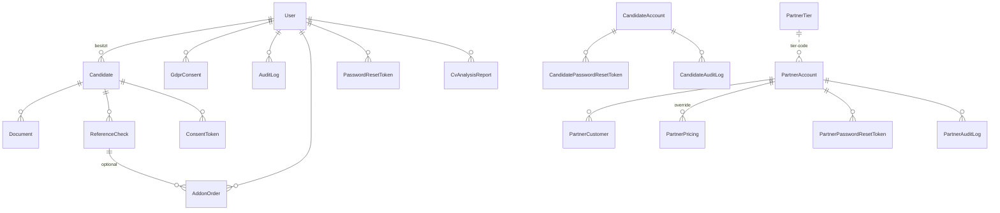

# 02 — Datenmodell

**Stand:** 2026-07-17 · Quelle: `prisma/schema.prisma` (21 Modelle). PII-Kennzeichnung: 🔴 hoch (Bewerber/Dritt-PII) · 🟠 mittel · ⚪ keine/technisch.

## ER-Diagramm (Kern-Domänen)

## Tabellen (Zweck & PII)

### HR-Kern
| Modell | Zweck | PII |
|---|---|:--:|
| **User** | HR-Account (email, name, company, password-Hash, plan, stripeCustomerId, `passwordChangedAt`) | 🟠 |
| **Candidate** | Bewerber (firstName, lastName, email?, phone?, position, notes?, gdprConsentIp) | 🔴 |
| **Document** | Datei-Metadaten; `path` = Blob-URL, `type` (CV/CERTIFICATE/…), `cvStatus` (Consent-Gate) | 🔴 (CV-Inhalt) |
| **ReferenceCheck** | Prüfung (employerContact/Phone/Email, callNotes, discrepancies, rating) | 🔴 (Dritt-PII Referenzgeber) |
| **AddonOrder** | Add-on-Käufe (sku, Beträge, stripeSessionId unique) | ⚪ |
| **CvAnalysisReport** | LLM-Claim-Analyse (`report` JSON, inputHash) | 🔴 (CV-abgeleitet) |

### Consent / DSGVO
| Modell | Zweck | PII |
|---|---|:--:|
| **ConsentToken** | Bewerber-Magic-Link: `tokenHash` (nie Klartext), `ipAccepted`, `uaAccepted`, `refereesJson`, status, TTL | 🔴 |
| **GdprConsent** | Consent-Records (type, granted, ip, userAgent) | 🟠 |
| **AuditLog** | System-/Zugriffs-Audit (userId?, action, entity, details, ip) | 🟠 |
| **PasswordResetToken** | Reset-Tokens (token, expiresAt, ip) | 🟠 |

### Bewerber-Self-Service (eigene Auth-Domäne)
| Modell | Zweck | PII |
|---|---|:--:|
| **CandidateAccount** | Bewerber-Login (email, passwordHash, Name, phone, `deletedAt` Soft-Delete) | 🔴 |
| **CandidatePasswordResetToken / CandidateAuditLog** | Reset + Audit | 🟠 |

### Partner-Programm (eigene Auth-Domäne)
| Modell | Zweck | PII |
|---|---|:--:|
| **PartnerAccount** | Partner-Login (email, passwordHash, company, contact, status, tier, `passwordChangedAt`) | 🟠 |
| **PartnerCustomer** | End-Mandanten (Kontakt, planKey, ek/end/marginCents Snapshot) | 🟠 |
| **PartnerPricing** | Globale Default- + Per-Partner-EK-Overrides (Monatsraten-Semantik!) | ⚪ |
| **PartnerTier** | 4 Tier-Stufen (Schwelle, Discount) | ⚪ |
| **PartnerPasswordResetToken / PartnerAuditLog** | Reset + Audit | 🟠 |

### Marketing
| Modell | Zweck | PII |
|---|---|:--:|
| **PilotApplication** | Pilot-Bewerbungen (Name, email, company, ip) | 🟠 |
| **LeadMagnetRequest** | Lead-Capture (firstName, email, company, ip) | 🟠 |

## PII-Speicherorte (Kurzüberblick)
- **Postgres (Supabase EU):** alle Tabellen oben.
- **Vercel Blob (EU):** CV-/Zeugnis-Dateien (`candidates/<userId>/<candidateId>/<uuid>`), Report-PDFs (`reports/<checkId>/`).
- **AuditLog.details / Logs:** enthält teils Klartext-Emails (bewusst für Nachweis; s. `09-KNOWN_ISSUES.md` G10/G11).

## Retention & Löschung
- **180-Tage-Cron** (`/api/cron/cleanup`): Candidates in Finalstatus (+Cascade), abgelaufene ConsentTokens, LeadMagnet, CvAnalysisReport, PilotApplication[REJECTED/WITHDRAWN] — **inkl. Blob-Dateien** (seit R2-Fix).
- **Art. 17 (User)**: `/api/gdpr/delete` — DB-Cascade + Blob-Löschung.
- **GdprConsent** wird bewusst behalten (Art.-7-Nachweispflicht).
- Details & Rechtsgrundlagen: `04-PRIVACY_DSGVO.md`.
